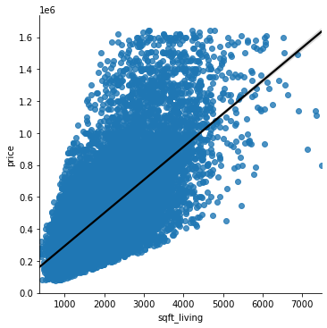
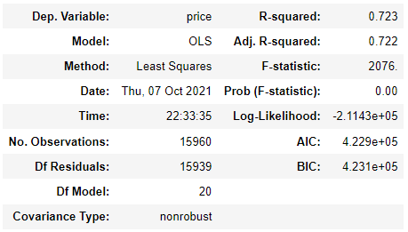
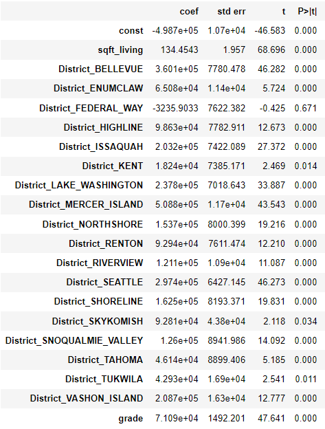
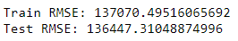

# King County Real Estate

**Author**: [Doug Mill](mailto:thedougmill@gmail.com)
            [Jakub Rybicki](mailto:jakubry92b@gmail.com)
            [Chris O'Malley](mailto:chriso2672@gmail.com)
 
## Overview

Our task is to build an inferential linear regression model. Our model will help our stakeholder understand King County home valuations better. We will follow the assumptions of linear regression which are linearity, independence, normality, and homoscedasticity. We will also strive to have a high R^2 value, signaling that our parameters are explaining much of the total variance in house sales.

## Business Understanding

Our stakeholder is an out-of-town real estate agency interested in opening an office in King County. The county seat is Seattle.

We are acting as a consultant for our stakeholder to determine key factors in evaluating a home in King County. We want to provide our client with the math and reasoning behind local home valuations. We will discuss the important features that affect a valuation based on analysis of previous home sales in the area. We will take a look at factors such as home size & space, school district in which the home is located, upgrades & amenities, and local market conditions.

Our stakeholder will be able to evaluate the Seattle and King County real estate market by understanding the key variables that affect price from our analysis.

## Data Understanding

Our original data set includes info about King County homes that sold between May 2nd, 2014 to May 24th, 2015. The target variable is price. We removed properties that were outside of three standard deviations of the mean price. This left us with homes with a price under $1.65M. We also removed typos. That took us from 21597 entries to 21280. We then incorporated 2015 School GIS data from kingcounty.gov in order to create our 'District' variable. The District variable includes the school district that the home is located in. There are 18 school districts in King County. We cleaned the original data set and merged it with the outside data in order to create our cleaned dataset, known as 'KingSchool.csv'. It can be found in the data folder.

## Data Preperation

For data preparation, we formatted many columns. We later decided we didn't need to use many of them. One of the important ones that we formatted that we ended up using in our final model was grade. We formatted it by going off the kingcounty.gov website 'Building Grade' guide. We classified from '3' which is 'short of minimum building standard' to '11' which is 'higher quality finish work...and more luxurious options'. We ended up eliminating samples where the price was outside of 3 standard deviations of the mean price. We then found a typo and removed it. This is how we cleaned the data from the dataset that was included which was kc_house_data.csv.

We incorporated 2015 School GIS data from the kingcounty.gov website. We then merged it with kc_house_data.csv on 4 different keys; 'id', 'lat', 'long', and 'zipcode'. This plotted the entries against district lines, and formed a column in which each entry was classified by the district that it was located in. There are 18 school districts in King County; Mercer Island, Bellevue, Seattle, Lake Washington, Vashon Island, Issaquah, Shoreline, Northshore, Snoqualmie Valley, Riverview, Highline, Renton, Skykomish, Enumclaw, Tahoma, Tukwila, Kent, and Federal Way.

Since district contained 18 categories, we changed it into dummy variables. By using get_dummies, District was transformed into 18 seperate variables. Each variable contains a 0 or 1. 0 signals that the house was not located in that district while 1 signals that it is present in that district.

We picked which columns that we wanted to focus on originally from a heatmap of correlations. We ran train test splits for every single model that we did. We also made sure to run StandardScaler on every single model we did in order to scale them.

Most of our data preparation process can be found in our [jupyter_notebook](/appendix/original_index_unabridged.ipynb) located in the appendix.
The rest of it can be found within [jupyter_notebook](/appendix/Chris_book.ipynb) located in the appendix. We needed to do this for code efficiency.

The code for the charts we used in our presentation are also located within our appendix in [jupyter_notebook](/appendix/original_index_unabridged.ipynb)

## Modeling

We created 6 models. Baseline model, First model, Good model, Great model, Awesome model, and Amazing model. In the end, we decided to go with Great model as our Final model.

Our Final model, known as "Great Model" has the follow predictors:

Square feet living
School Districts
Building Grade
We decided Great Model is adequate with an R-squared value of .72 with only 3 predictors. The simplicity of it makes it easy to understand and use while also explaining such a high amount of the variance in price.



## Regression Results

Awesome model has an R-squared of .742. Building on Great model, adding yr_built explains 74.2% of the variance in price. The inclusion of yr_built raised our R-squared from .72 to .74, for an increase of .02. Our awesome model mostly follow the linearity assumption, but the linearity of yr_built is vague. The distribution of errors is skewed right. Good model has low multicollinearity in general, with all VIF below 5 except for District_SEATTLE at 7. It passes the homoscedasticity test.







We decided to use Great Model as our Final model. This model did very well with 3 predictors. Those predictors are square feet living, school district, and grade. The reasoning for selecting Great Model even though some of the following models had higher R-squared values was because it was simple, yet understandable. The following models seemed to muddy the waters when it came to the linearity assumption.

The Great Model is able to explain 72.3% of the variance in price of King County Home Sales in 2014-15 with just 3 predictors. This is a good R-squared value as it is above the 70% threshold. The model had a Train RMSE of 137070.49516065692 and a Test RMSE of 136447.31048874996. These are very close to each other, meaning the fit of the model is not underfit or overfit.

The Great Model does a great job at helping our stakeholder, the real estate agency, understand the gist of what drives home prices in the King County area. More specifically, it gives invaluable information about which school district they should target for either top end or bottom end location values.

## Conclusions

Our model showed us that the most important predictors to look at in a home are going to be square feet living, school district, and building grade. To relate this back to our stakeholder, we want to inform the real estate agency to focus on these elements in their deals. We can also help them by allowing them to plot different values in our model and giving them a rough valuation based on these variables.

Our model separates each home into 3 basic elements that contribute to value:

Home size & usable space (sqft_living)
Location (school district)
Upgrades, amenities, & design elements (grade)
To improve our model in the future, we could bin house sales by neighborhood. We could then compare home sales within individual neighborhood and model what features accounted for the discrepancies in sales price. This would give us a more detailed look at what features distinguish home valuations. This would also help the stakeholder with their offers and listings in a more detailed and refined level. More data would also be very useful. Another thing we could improve on is using more location metrics. The location metrics we would want to add include proximity to shopping, amenities, entertainment, recreation, airports, parks, schools, landmarks, tourist attractions, and employment opportunities.

## For More Information

See the full analysis in the [Jupyter Notebook](index.ipynb) or review this [Presentation](Phase 2 Group.pdf).

For additional info, contact [Jakub Rybicki](mailto:jakubry92b@gmail.com), [Chris O'Malley](mailto:chriso2672@gmail.com), [Doug Mill](mailto:thedougmill@gmail.com)

## Repository Structure

```
├── appendix
├── data
├── images
├── .gitignore
├── README.md
├── index.ipynb
└── Phase 2 Group.pdf
